# Bug Reports: Single Bet Placement

Defects found while executing TC-01, TC-02 and TC-03 from test-plan.md,
plus short exploratory sessions around the placement flow, the filters and the bet slip.

**Environment:** as in the test plan's global preconditions. The balance is reset with
`POST /api/reset-balance` before every reproduction; the reset persists 120.00, not the
documented 125.50 (BUG-06), so the balances below start from 120.00.

**Severity:** Critical = money or regulatory exposure, or the core journey is unusable.
High = a customer-facing record or a stated contract is wrong. Medium = an explicit rule is
broken but there is a workaround. Low = inconsistency with no money path.

**Evidence:** screenshots live in `evidence/`, named by bug; raw API captures are in
[api-findings.log](../evidence/api-findings.log). No frame shows the user id: browser frames
are cropped without the address bar and Postman frames use `{{baseUrl}}` with header auth.

## Execution results

| Scenario (test-plan.md) | Result | Defects |
|----|----|----|
| TC-01 Place a bet on an upcoming match, stake debited, receipt issued | Failed | BUG-05, BUG-07, BUG-11 (placement and debit work; the receipt and the balance display do not) |
| TC-02 API rejects negative stakes and stakes beyond available funds | Failed | BUG-01, BUG-02, BUG-08 (currency contract of the same response) |
| TC-03 Betting on a PAST match is rejected | Failed | BUG-03 |
| Exploration and the automated suite | | BUG-04, BUG-06 (caught by the API test), BUG-09, BUG-10, BUG-12 to BUG-15 |

## Summary

Four Critical and two High are the ones that cost money. The rest are listed so a fix can
be verified, each in the required fields and no longer than that.

| ID | Title | Severity |
|----|-------|----------|
| BUG-01 | API accepts a negative stake and credits the account | Critical |
| BUG-02 | Stake above the available balance is accepted; balance goes negative | Critical |
| BUG-03 | Bets accepted on finished (PAST) matches | Critical |
| BUG-04 | Double click places the bet twice | Critical |
| BUG-05 | Receipt payout is stake x 2, odds ignored | High |
| BUG-06 | reset-balance answers 125.50 and stores 120.00 | High |
| BUG-07 | Receipt prints away vs home | Medium |
| BUG-08 | place-bet returns currency USD, everything else says EUR | Medium |
| BUG-09 | Odds filter lower bound is exclusive | Medium |
| BUG-10 | Inverted odds range is accepted silently | Medium |
| BUG-11 | Header and slip balance do not refresh after a bet | Medium |
| BUG-12 | Match counter ignores filters; no empty state | Medium |
| BUG-13 | Receipt omits the Selection field | Medium |
| BUG-14 | Malformed or extreme place-bet input returns 500 | Low |
| BUG-15 | GET /api/place-bet returns 200 instead of 405 | Low |

BUG-05, BUG-07 and BUG-08 are each encoded as a strict-xfail test that turns into a real
failure the moment the defect is fixed. BUG-11 is deliberately not automated.

---

## BUG-01: API accepts a negative stake and credits the account

**Severity:** Critical

**Steps:**
1. Reset, read the baseline with `GET /api/balance`.
2. `POST /api/place-bet` on an upcoming match with `"stake": -1.0`, then `-100.0`, then `-0.01`.

**Expected:** 422. Spec 4.1 requires a positive minimum at UI and API, the Domain Context
says a stake "must be a positive number", and the OpenAPI schema declares `stake minimum: 1`.

**Actual:** all three are accepted with 200 "Bet placed successfully". After a reset,
stake `-1.0` returns payout `-2.21`. After another reset, `-100` returns payout `-220.01`
and the balance rises from 120 to 220; `-0.01` on top lifts it to 220.01. The delta is
exactly |stake| every time. Only positive values below 1.00 are rejected (`0.0`
gives `invalid_stake_min`); the sign is never checked.

**Business Impact:** a negative stake is a withdrawal. With a real payment integration this
is money leaving the operator.

**Evidence:**

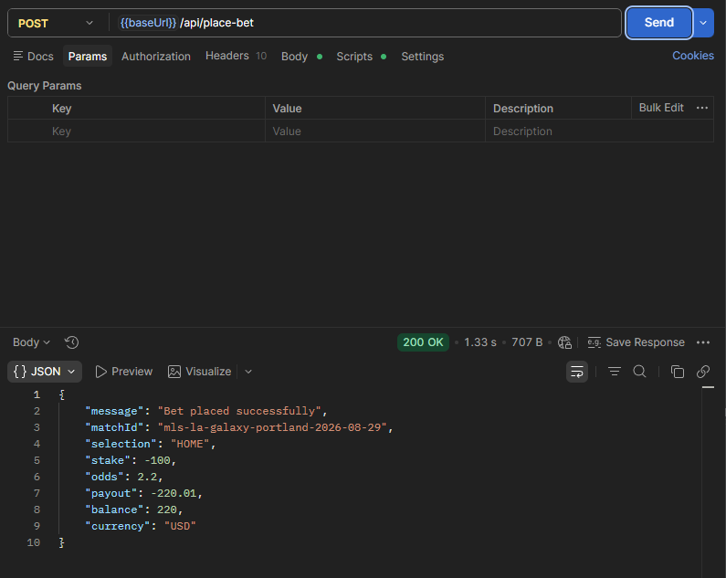

*stake -100 accepted: payout -220.01, balance 220. The same response shows `currency: "USD"` (BUG-08).*

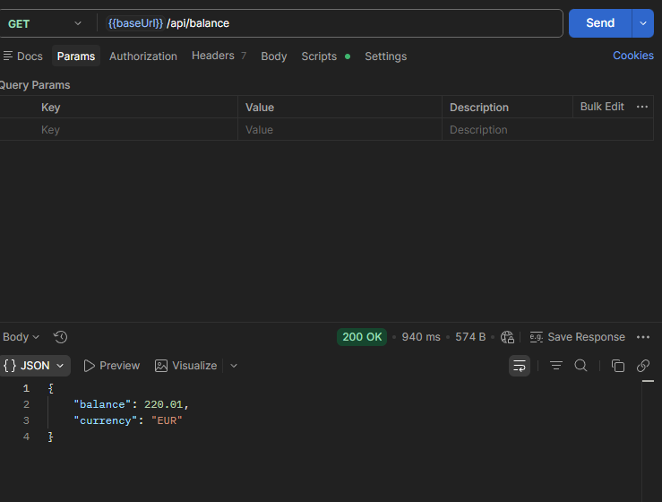

*stake -0.01 accepted and the credited balance persisted.*

---

## BUG-02: Stake above the available balance is accepted; balance goes negative

**Severity:** Critical

**Steps:**
1. Reset (balance 120.00).
2. `POST /api/place-bet` with stake `100`; balance drops to 20.00.
3. Post stake `100` again (on a second upcoming match if the first one is blocked).

**Expected:** rejected as insufficient balance (Spec 4.1, "must not exceed available
balance"). The OpenAPI `Error` schema even uses `insufficient_balance` as its example, an
error code the API never produces.

**Actual:** 200, balance `-80`. The overdraft is unbounded: bets are accepted from an
already negative balance, which is how the header reached `€-280.00`. The same hole is
reachable in the UI through Rebet after a 409 (bet B-52369, balance -95). The maximum-stake
check is a constant band (`invalid_stake_max` fires even when the balance exceeds 100), so
there is no funds check on the server at all. The UI blocks new bets once the balance is
negative, so the defect is API side.

**Business Impact:** users spend money they do not have.

**Evidence:**

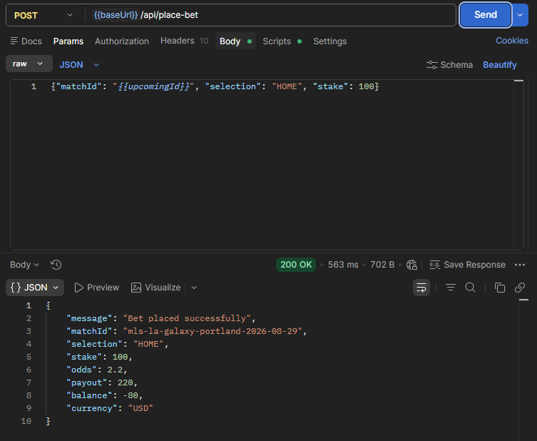

*two stakes of 100 from a balance of 120: the second one is accepted, balance -80.*

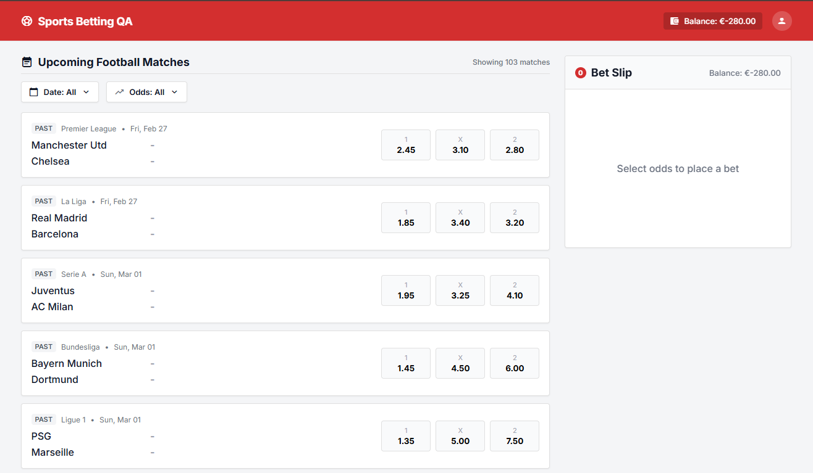

*the header rendering `Balance: €-280.00`.*

---

## BUG-03: Bets accepted on finished (PAST) matches

**Severity:** Critical

**Steps:**
1. Pick a card badged `PAST` (kickoffs go back about six months).
2. Select an outcome, enter a valid stake, click `Place Bet`.
3. Repeat with `POST /api/place-bet` and a past `matchId`.

**Expected:** rejected at every layer. Spec 1: "Upcoming/Pre-match events only"; Spec 3:
"Upcoming matches only"; Spec 2.1: "Display upcoming football matches". The OpenAPI describes `GET /api/matches` as "List of upcoming
matches".

**Actual:** 200 and a receipt (bets B-99886, B-78032, B-61975). The app knows the status,
it renders the badge, but the odds buttons stay active. On the test date 72 of the 103
catalog matches were already played; the date filter defaults to `All` and navigates into
past months, so nothing hides them.

**Business Impact:** a bet on an event with a known result is a guaranteed loss for the
operator.

**Evidence:**

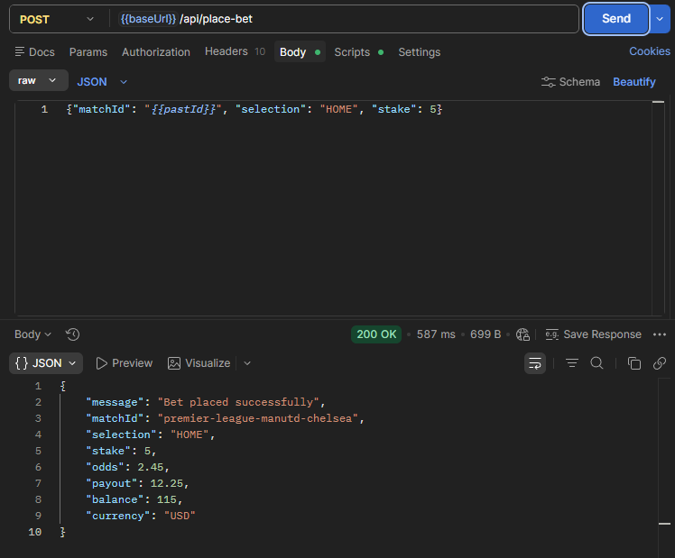

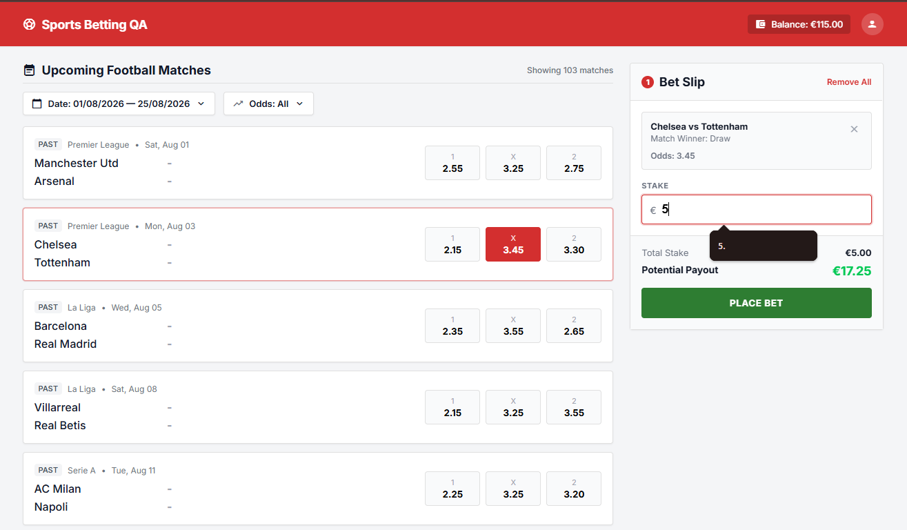

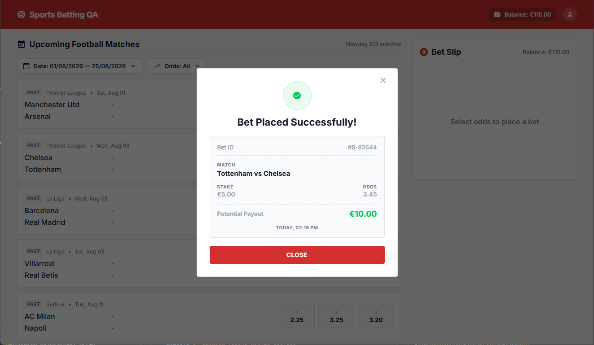

*API acceptance, the PAST fixture in the slip, and the receipt. Log:
[api-findings.log](../evidence/api-findings.log), section BUG-03.*

---

## BUG-04: Double click places the bet twice

**Severity:** Critical (see the scope note)

**Steps:**
1. Select an outcome, enter stake 5.
2. Click `Place Bet` two or three times quickly.

**Expected:** one action, one bet (Domain Context, Bet Slip: "Only one bet can be
active at a time"); Spec 5.3: 409
for a bet already in progress.

**Actual:** every click becomes its own place-bet call, all 200, all debiting. Three clicks
with stake 5, from a balance of 110 at that point of the session, produced response
balances 105, 100, 95; an earlier two-click run with stake 2 produced 111, 109. On a
slower overlap the second call does get 409 `bet_in_progress`, so the guard exists but has
a race window.

**Scope note:** the hiring team's assignment e-mail calls this "not a real-time
scenario". This is a double click,
not a load test; Critical by consequence.

**Business Impact:** double debit, and more bets than the user intended.

**Evidence:**

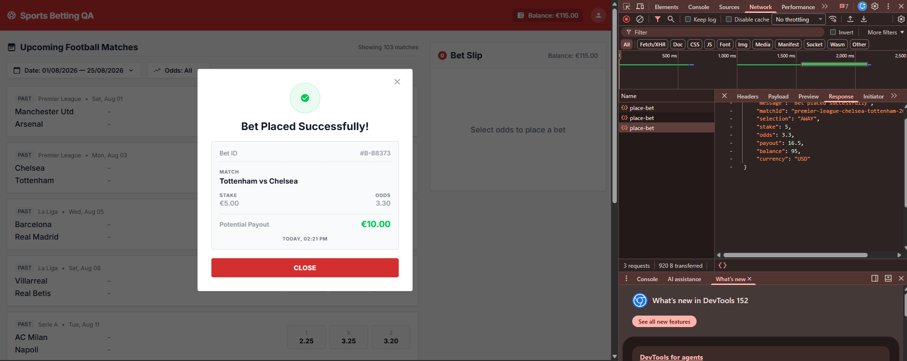

*Network panel: three place-bet requests, all 200, balances stepping 105, 100, 95.*

---

## BUG-05: Receipt payout is stake x 2, odds ignored

**Severity:** High

**Steps:**
1. Select an outcome with odds other than 2.00, enter a stake. The slip shows stake x odds.
2. Click `Place Bet` and compare the receipt payout with the place-bet response.

**Expected:** payout = stake x odds (Domain Context); the receipt must match what the
slip showed (fields: Spec 2.4; consistency: Domain Context, Bet Receipt).

**Actual:** the receipt shows stake x 2. Stake 5 at 5.40 shows 10 (should be 27); 100 at
3.10 shows 200 (should be 310); 100 at 6.00 shows 200 (should be 600). The API payout is right (10 at 2.2 returns 22.00), so the
stored bet is correct and only the receipt is wrong.

**Business Impact:** the customer sees a wrong payout at the moment of confirmation.

**Evidence:**

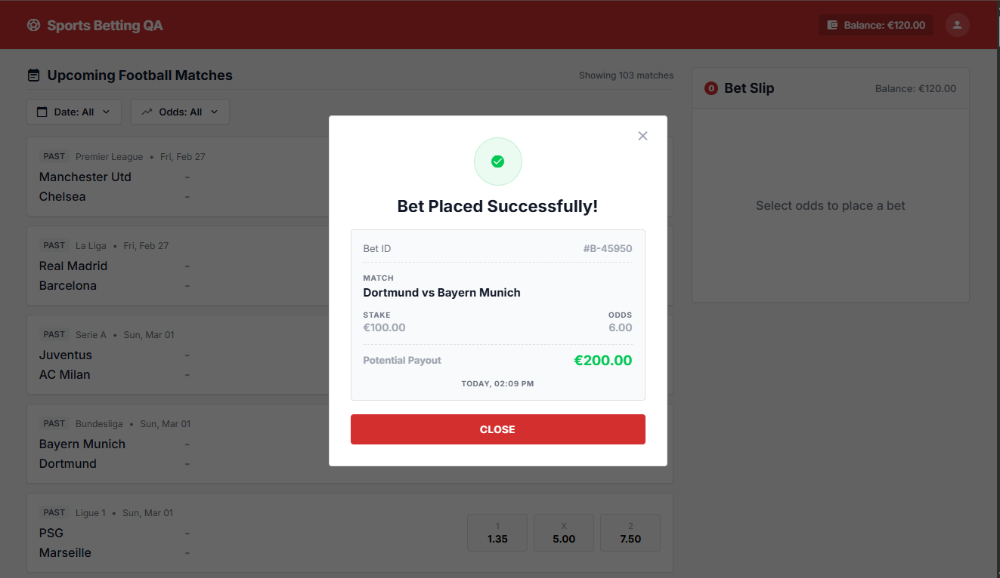

*stake €100.00 at odds 6.00, receipt says €200.00. Reproduced on every run by the strict
xfail `test_receipt_payout_matches_odds`.*

---

## BUG-06: reset-balance answers 125.50 and stores 120.00

**Severity:** High

**Steps:**
1. `POST /api/reset-balance`.
2. `GET /api/balance`, compare the two `balance` values.

**Expected:** Spec 5.3: "Response body and persisted state must be consistent after
reset"; the starting balance is €125.50 (Domain Context).

**Actual:** the reset answers `125.5`, the read returns `120`, every time. Found by the
API test on its first run. The OpenAPI 200 description says the payload "may differ from
persisted balance", which contradicts the feature spec (open question 6).

**Business Impact:** any client that trusts the reset response works on wrong state.

**Evidence:**

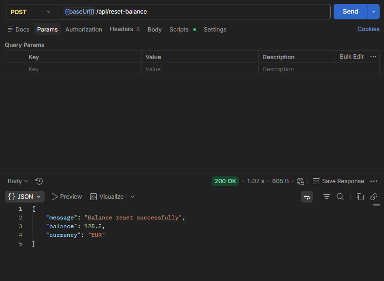

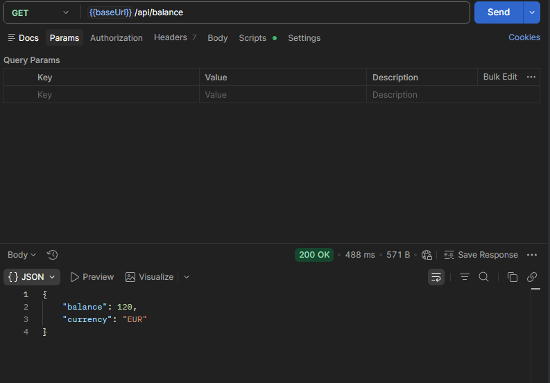

*reset response and the read that follows it. Log: [api-findings.log](../evidence/api-findings.log), section BUG-06.*

---

## BUG-07: Receipt prints away vs home

**Severity:** Medium

**Steps:** place a bet, compare the team order in the list, the slip and the receipt.

**Expected:** home team first, "this convention carries through to the bet receipt"
(Domain Context, Match Ordering).

**Actual:** list and slip are right, the receipt is always reversed (Chelsea vs Manchester
Utd, Barcelona vs Real Madrid, Portland Timbers vs LA Galaxy). The selection itself is
mapped correctly.

**Business Impact:** the receipt names a different fixture than the one bet on.

**Evidence:**

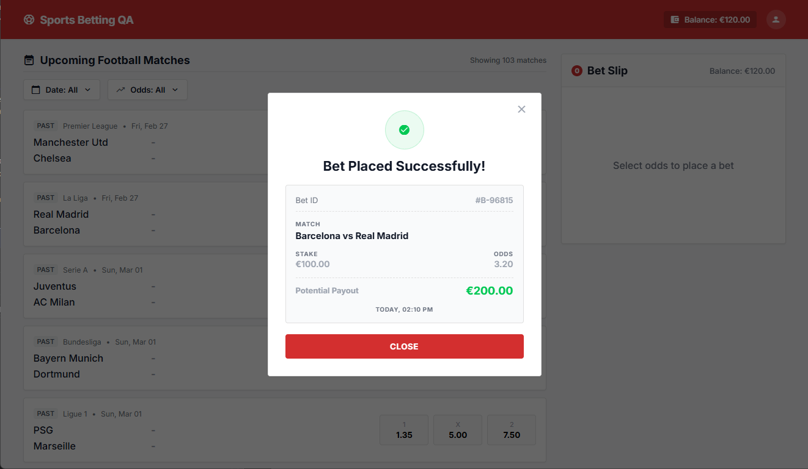

*the card lists Real Madrid at home; the receipt prints "Barcelona vs Real Madrid". Same
frame as BUG-13. Reproduced by the strict xfail `test_receipt_team_order`.*

---

## BUG-08: place-bet returns currency USD, everything else says EUR

**Severity:** Medium

**Steps:** `GET /api/balance`, then place a bet and read `currency` in the response.

**Expected:** EUR (Spec 3, Spec 5.3 for both endpoints).

**Actual:** balance says `EUR`, place-bet says `USD`, the UI renders `€`. Confirmed on a
plain bet: stake 10 at odds 2.2, `currency: "USD"`. The OpenAPI types `currency` as a free
string with example EUR, so schema validation would not catch this.

**Business Impact:** the same amount in two currencies across adjacent responses.

**Evidence:** the place-bet frame under BUG-01 and
[api-findings.log](../evidence/api-findings.log), section BUG-08. Encoded as the strict xfail
`test_place_bet_currency_is_eur`.

---

## BUG-09: Odds filter lower bound is exclusive

**Severity:** Medium

**Steps:**
1. Date filter `All`. Apply odds `1.35` to `1.35` (PSG vs Marseille has home odds 1.35),
   then `1.34` to `1.36`.
2. Apply `7.50` to `10.00`, then `7.49` to `10.00` (a match has away odds 7.50).

**Expected:** inclusive bounds (Spec 2.6).

**Actual:** `1.35-1.35` is empty, `1.34-1.36` shows the match; `7.50-10.00` drops the
7.50 market, `7.49-10.00` includes it. The lower bound is compared with `<` instead of
`<=`, so every point range is empty.

**Business Impact:** available markets disappear at the boundary.

**Evidence:**

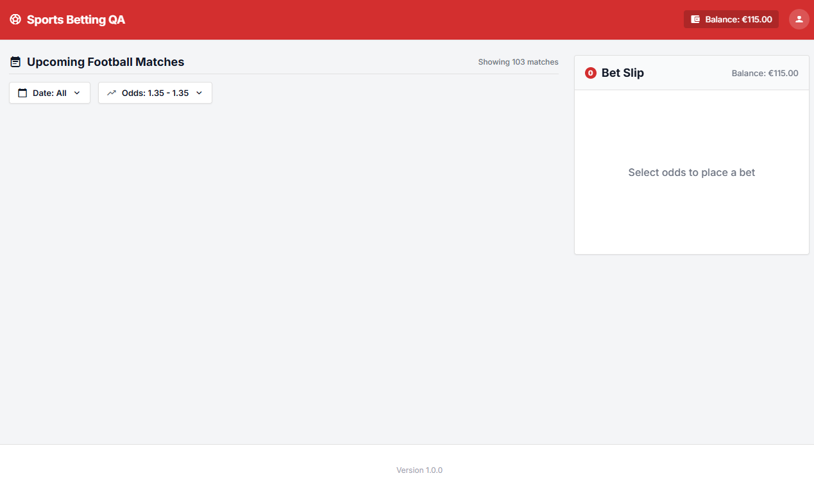

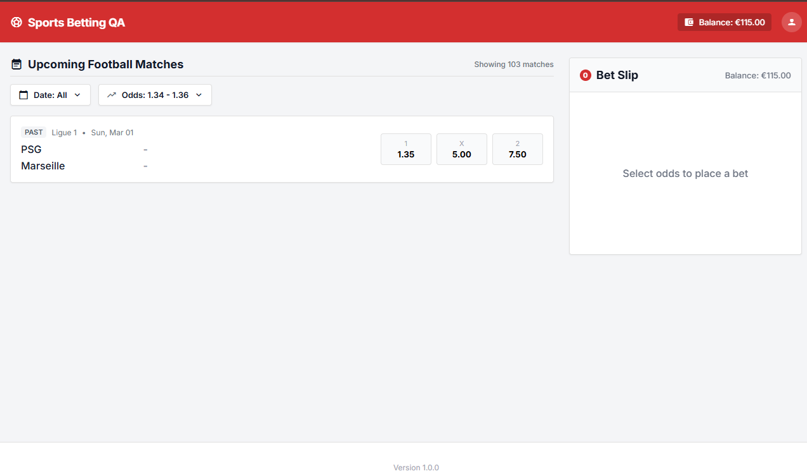

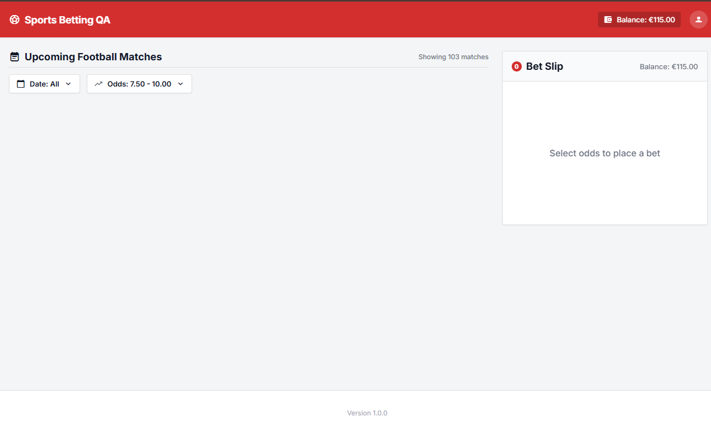

*the same two markets at the boundary and one hundredth below it.*

---

## BUG-10: Inverted odds range is accepted silently

**Severity:** Medium

**Steps:** odds filter min `2.09`, max `1.35`, Apply. Repeat with `10.00` to `1.00`.

**Expected:** "must reject invalid ranges with clear feedback" (Spec 2.6).

**Actual:** applied without a word; empty list, no message. An impossible range looks the
same as a range that matched nothing.

**Business Impact:** the user reads "no matches" instead of "invalid range".

**Evidence:**

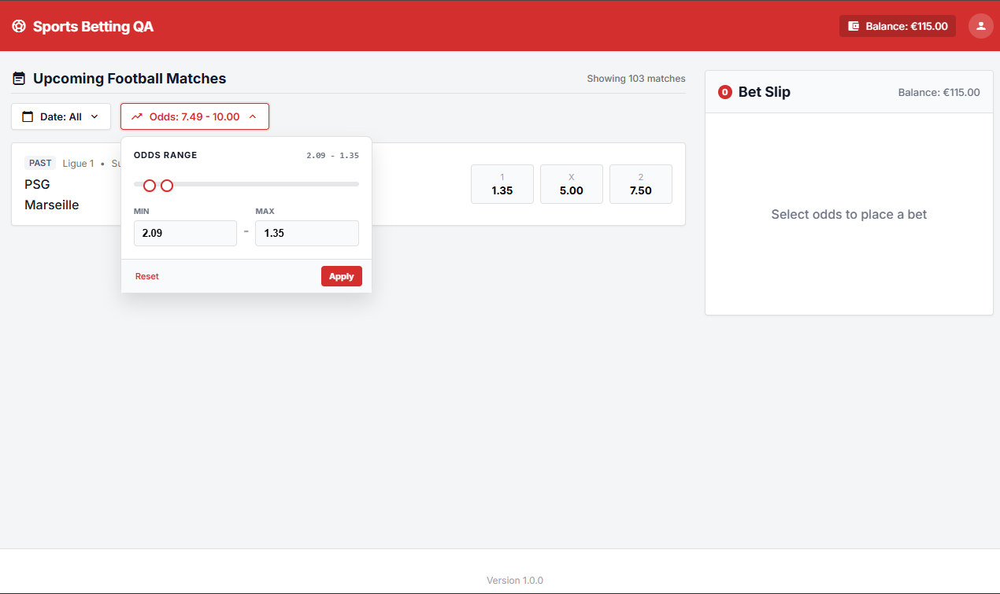

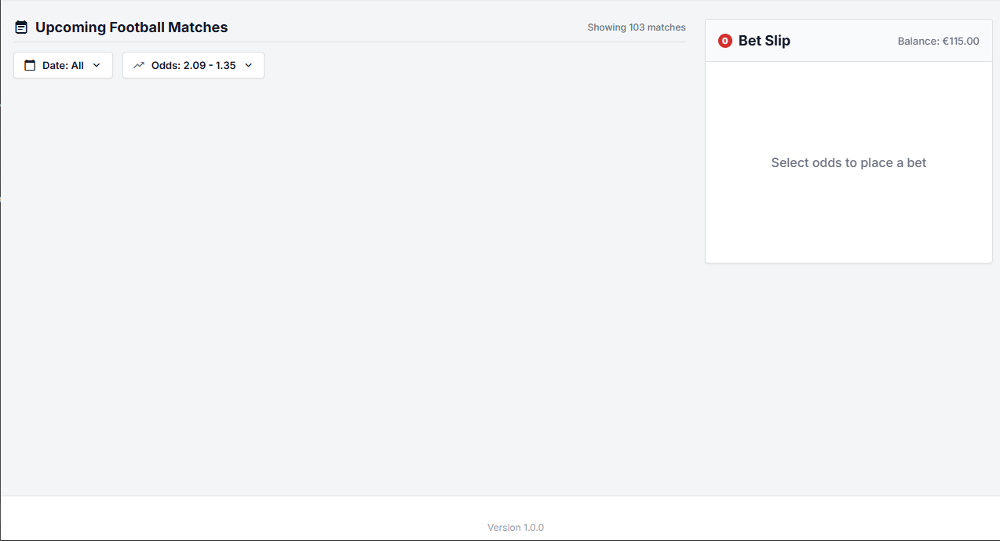

---

## BUG-11: Header and slip balance do not refresh after a bet

**Severity:** Medium

**Steps:** note the balance, place a bet, close the receipt, read header and slip, then reload.

**Expected:** the shared balance shows the debit right after success (Spec 2.2, 2.3, Domain
Context).

**Actual:** both keep the old value until a full reload. The server has debited correctly
(`GET /api/balance` confirms). Sampled for six seconds: it is a missing refresh, not a slow
one.

**Business Impact:** the next bet is validated client side against a stale balance.

**Evidence:**

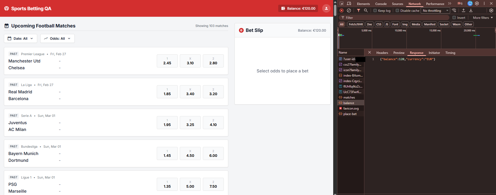

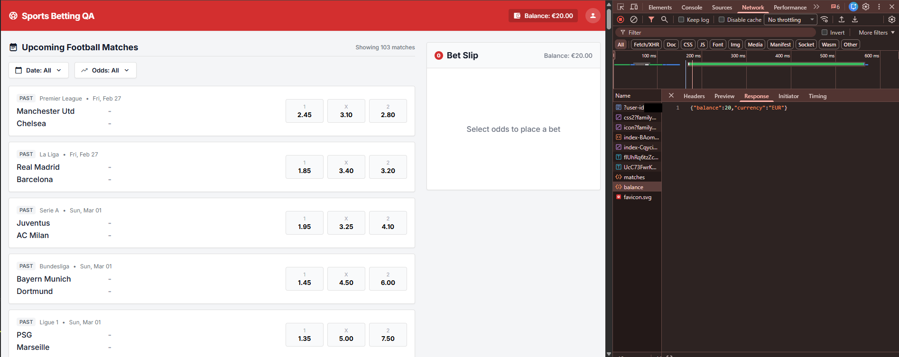

*before and after reload. Not automated on purpose: asserting "does not update" from a
browser is flaky by construction.*

---

## BUG-12: Match counter ignores filters; no empty state

**Severity:** Medium (no explicit spec line for the counter)

**Steps:** narrow any filter down to zero results, read the counter and the list area.

**Expected:** the counter reflects the filtered result; an empty result carries a message.

**Actual:** "Showing 103 matches" whatever is visible; zero results render a blank area.
The counter is right only when the user id is rejected and the list is empty
("Showing 0", open question 2).

**Business Impact:** "103" above an empty screen; the user stops trusting the filters.

**Evidence:** the `1.34-1.36` frame under BUG-09: one card rendered, counter still 103.

---

## BUG-13: Receipt omits the Selection field

**Severity:** Medium

**Steps:** bet on AWAY on any match, read the receipt.

**Expected:** Spec 2.4 lists the receipt fields: Bet ID, match, Selection, stake, odds,
payout, timestamp.

**Actual:** everything but Selection. The user cannot confirm which outcome was bet on.

**Business Impact:** the receipt is the proof of bet; without the selection it cannot settle
a dispute.

**Evidence:** the receipt frame under BUG-07 (`bug-07-13-receipt.png`).

---

## BUG-14: Malformed or extreme place-bet input returns 500

**Severity:** Low

**Steps:** `POST /api/place-bet` with body `{not json` (malformed), then with stake
`-1e308` (valid JSON, an extreme number), content type `application/json`.

**Expected:** the malformed body gets 400 (Spec 4.3 and 5.3; the OpenAPI documents the
codes `invalid_json` and `invalid_request`, which the application never actually emits);
the extreme number gets a 422 stake rejection. Neither input is a server fault.

**Actual:** 500 `internal_server_error`, "Unable to process request.", for both.

**Business Impact:** client mistakes show up as server errors in monitoring.

**Evidence:**

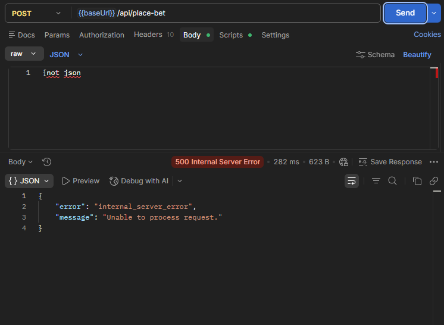

---

## BUG-15: GET /api/place-bet returns 200 instead of 405

**Severity:** Low

**Steps:** `GET /api/place-bet` with a valid header and no body. For contrast,
`POST /api/matches` and `GET /api/reset-balance`.

**Expected:** 405 (Spec 4.3 and 5.3; the OpenAPI lists 405 on every route).

**Actual:** 200 with `{}`. The other routes return 405 `method_not_allowed`, so the
mechanism exists and only place-bet misses it.

**Business Impact:** a wrong verb on the money endpoint looks like success to any client
keying on the status code; no money moves.

**Evidence:** [api-findings.log](../evidence/api-findings.log), section BUG-15.

---

## Spec and contract notes

**SPEC-INCONSISTENCY-01, stake minimum 1.00 vs 1.01.** Spec 3 ("Stake min €1.00"), the
required UI copy in Spec 4.4 ("Minimum stake is €1.00") and the OpenAPI (`stake minimum:
1`) say 1.00; the validation table in Spec 4.1 says 1.01. The app accepts 1.00 and rejects
0.99 with "Minimum stake is €1.00". Three sources and the code agree; row 4.1 is the
outlier. The automated boundary case asserts 1.00 and carries the conflict in its case title.

**OpenAPI (`/api/docs?format=json`) against the feature spec and the app:**
- `POST /api/reset-balance` is described as "response payload may differ from persisted
  balance", the opposite of Spec 5.3 (BUG-06).
- `GET /api/matches` is described as a list of upcoming matches; it returns played fixtures
  (BUG-03).
- `currency` is a free string in every schema, so a schema check would not catch USD
  (BUG-08). `stake` has min and max but no precision constraint.
- `PlaceBetResponse` has no bet id, while the receipt prints one (question 7).
- `kickoffDate` is `format: date`, so no kickoff time can exist (question 5).
- The `Error` example is `insufficient_balance`, a code the API never emits (BUG-02).
- The `x-user-id` header is documented as a "Session token", which is why this submission
  treats the candidate id as a secret.

## Open questions for the PO

1. Should the entered stake survive a change of selection? It is cleared today.
2. What should an unknown user id show? The API rejects it correctly: 401
   `invalid_user_id` from `/api/matches` and `/api/balance`, the two calls the page makes
   on load. The UI still renders the full shell with an "Unauthorized" panel and
   `Balance: €0.00`, the header's default before any balance arrives. No rule is broken;
   a dedicated access-error state may still be wanted.
3. Should a PAST card render clickable odds at all (it already shows a dash for the
   score), and should the default date filter be `All`, 72 played fixtures deep? Taking
   the bet is BUG-03; this is about display.
4. Payout rounding: stake x odds can carry a third decimal (1.01 x 3.45 = 3.4845).
   Round it or cut it, and is one rule shared by the slip, the receipt and the API? The
   spec gives the formula but no rule; our captured runs happened to come out exact.
5. Spec 2.1 wants a "kickoff date/time label"; the contract carries a date only
   (`kickoffDate`, `format: date`). Drop the time from the requirement or add a timestamp
   to the contract? The answer also fixes when "upcoming" turns "past" on match day.
6. Which is canonical for reset-balance: Spec 5.3 "response body and persisted state
   must be consistent" or the OpenAPI's "payload may differ from persisted balance"?
   Spec canonical means the API is broken (BUG-06); OpenAPI canonical means BUG-06 is by
   design and the spec needs the fix.
7. Where does the receipt's Bet ID come from? The place-bet response has none; a
   client-generated id cannot be reconciled with any server record.
8. Should the slip keep computing a potential payout while the stake is invalid? For stake
   105.23 it shows the maximum-stake error in red and a green payout of €326.21 side by
   side. The arithmetic is right and the spec does not forbid it, so this is a design
   choice to confirm, not a defect.
